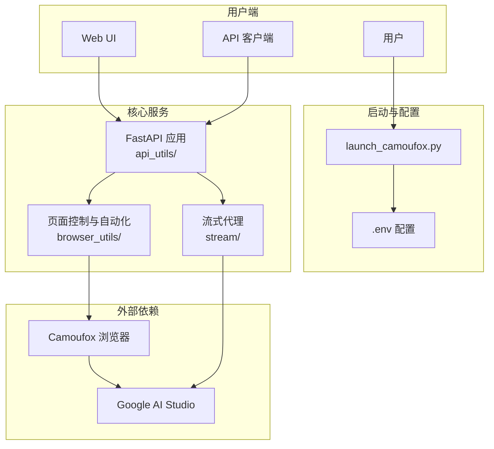

# AI Studio Proxy API

将 Google AI Studio 网页界面转换为 OpenAI 兼容 API 的代理服务。通过 Camoufox + Playwright 自动化，提供稳定可控的 API 访问。

[](https://www.star-history.com/#CJackHwang/AIstudioProxyAPI&Date)

---

## 主要特性

- **OpenAI 兼容 API**：支持 `/v1/chat/completions`、`/v1/models`
- **函数调用三模式**：`auto` / `native` / `emulated`，支持失败回退
- **认证轮转与 Cookie 刷新**：支持 profile 自动轮转、周期刷新与关停保存
- **启动链路完整**：CLI 启动器、内置 Web UI、桌面 GUI 启动器
- **现代化前端**：内置设置页、状态检查与日志能力
- **CI/CD 工作流**：PR 检查、Release、Upstream Sync

## 系统要求

| 组件 | 要求 | 推荐 |
| --- | --- | --- |
| Python | >=3.9, <4.0 | 3.10+ / 3.11+ |
| 依赖管理 | Poetry | 最新版本 |
| Node.js | 前端构建需要 | LTS |
| 内存 | >=2GB | >=4GB |

---

## 🚀 快速开始

### 1. 克隆并安装

```bash
git clone https://github.com/CJackHwang/AIstudioProxyAPI.git
cd AIstudioProxyAPI
poetry install --with dev
```

### 2. 配置环境

```bash
cp .env.example .env
```

建议先确认：`PORT`、`STREAM_PORT`、`UNIFIED_PROXY_CONFIG`、`LAUNCH_MODE`、`FUNCTION_CALLING_MODE`。

### 3. 首次认证并启动

```bash
# 首次建议 debug，完成登录并保存 auth
poetry run python launch_camoufox.py --debug

# 日常建议 headless
poetry run python launch_camoufox.py --headless
```

### 快速测试

```bash
# 健康检查
curl http://127.0.0.1:2048/health

# 模型列表
curl http://127.0.0.1:2048/v1/models

# 聊天请求
curl -X POST http://127.0.0.1:2048/v1/chat/completions \
  -H "Content-Type: application/json" \
  -d '{"model":"gemini-2.5-pro","messages":[{"role":"user","content":"你好"}]}'
```

访问 `http://127.0.0.1:2048/` 使用内置 Web UI。

---

## 系统架构



---

## 运行模式

| 命令 | 说明 | 场景 |
| --- | --- | --- |
| `python launch_camoufox.py --headless` | 无头模式 | 日常使用、服务器 |
| `python launch_camoufox.py --debug` | 调试模式 | 首次认证、故障排查 |
| `python launch_camoufox.py --virtual-display` | 虚拟显示 | Linux 无 GUI 环境 |

---

## ⚙️ 配置

项目使用 `.env` 统一配置管理：

```bash
cp .env.example .env
```

核心配置示例：

| 配置 | 默认值 | 说明 |
| --- | --- | --- |
| `PORT` | `2048` | 主 API 端口 |
| `STREAM_PORT` | `3120` | 流式代理端口（`0` 关闭） |
| `UNIFIED_PROXY_CONFIG` | 空 | HTTP/HTTPS 代理 |
| `AUTO_ROTATE_AUTH_PROFILE` | `true` | 认证自动轮转 |
| `FUNCTION_CALLING_MODE` | `auto` | 函数调用模式 |

详细项见：[配置参考](docs/configuration-reference.md)

> 说明：配置默认值以 `.env.example` 为准；少数配置存在代码兜底默认值，详见配置参考中的说明。

---

## 📚 文档

- [文档总览](docs/README.md)
- [快速开始](docs/quick-start.md)
- [部署与运维指南](docs/deployment-and-operations.md)
- [API 使用说明](docs/api-usage.md)
- [函数调用模式](docs/function-calling.md)
- [认证轮转与 Cookie 刷新](docs/auth-rotation-cookie-refresh.md)
- [排障指南](docs/troubleshooting.md)
- [开发、测试与发布](docs/development-and-release.md)

---

## 客户端配置示例

以 Open WebUI 为例：

1. 进入设置 -> 连接
2. API Base URL 填 `http://127.0.0.1:2048/v1`
3. 若你未配置 API Keys，可留空或填任意字符；若已配置，请填写有效 Key
4. 保存后即可对话

---

## 开发检查

```bash
poetry run ruff check .
poetry run pyright
poetry run pytest
```

前端构建：

```bash
cd static/frontend
npm ci
npm run build
```

---

## 致谢

- **项目发起与主要开发**: [@CJackHwang](https://github.com/CJackHwang)
- **核心维护**（架构重构、测试体系）: [@NikkeTryHard](https://github.com/NikkeTryHard)
- **功能完善、页面操作优化**: [@ayuayue](https://github.com/ayuayue)
- **实时流式功能优化**: [@luispater](https://github.com/luispater)
- **项目重构贡献**: [@yattin](https://github.com/yattin)（Holt）
- **下游维护分支致谢作者**: [@MasuRii](https://github.com/MasuRii)
- **社区支持**: [Linux.do 社区](https://linux.do/)

## License

[AGPLv3](LICENSE)

## 支持作者

如果本项目对你有帮助，欢迎支持作者持续开发：


