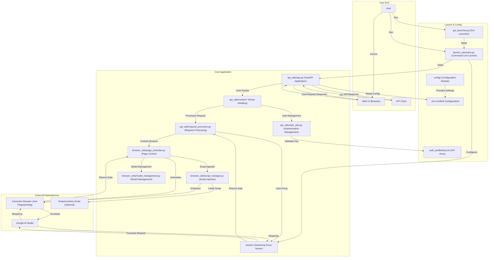

# AI Studio Proxy API

This is a Python-based proxy server that converts Google AI Studio's web interface into an OpenAI-compatible API. Through Camoufox (anti-fingerprinting Firefox) and Playwright automation, it provides stable API access.

This fork is the primary English version of the original project.

This project is generously sponsored by ZMTO with server support. Visit their website: [https://zmto.com/](https://zmto.com/)

---

## Acknowledgements

The birth and development of this project cannot be separated from the generous support and wisdom contributions of the following individuals, organizations, and communities:

- **Project initiation and main development**: @CJackHwang ([https://github.com/CJackHwang](https://github.com/CJackHwang))
- **Feature enhancement and page operation optimization ideas**: @ayuayue ([https://github.com/ayuayue](https://github.com/ayuayue))
- **Real-time streaming functionality optimization and improvement**: @luispater ([https://github.com/luispater](https://github.com/luispater))
- **3400+ line main file project refactoring great contribution**: @yattin (Holt) ([https://github.com/yattin](https://github.com/yattin))
- **High-quality project maintenance in later stages**: @Louie ([https://github.com/NikkeTryHard](https://github.com/NikkeTryHard))
- **English version maintainer**: @MasuRii ([https://github.com/MasuRii](https://github.com/MasuRii))
- **Community support and inspiration**: Special thanks to the [Linux.do Community](https://linux.do/) members for their enthusiastic discussions, valuable suggestions, and problem feedback - your participation is an important driving force for the project's progress.

At the same time, we sincerely thank every friend who has silently contributed to this project through submitting Issues, providing suggestions, sharing usage experiences, contributing code fixes, and other ways. It is your joint efforts that make this project better!

---

**This is the currently maintained Python version.**

## 📊 Compatibility Matrix

| Component | Version Requirements | Recommended Version | Description |
|----------|---------------------|---------------------|-------------|
| **Python** | ≥3.9, <4.0 | 3.10+ or 3.11+ | Docker environment uses 3.10 |
| **Operating System** | Windows / macOS / Linux | - | Full cross-platform support, Docker supports x86_64 and ARM64 |
| **Memory** | ≥2GB | ≥4GB | Browser automation required |
| **Network** | Stable internet connection | - | Configurable proxy to access Google AI Studio |
| **Dependency Management** | Poetry | Latest version | Modern Python dependency management tool |
| **Type Checking** | Pyright (optional) | Latest version | Used for type checking and IDE support during development |

## System Requirements

- **Python**: >=3.9, <4.0 (recommend 3.10+ for best performance, Docker environment uses 3.10)
- **Dependency Management**: [Poetry](https://python-poetry.org/) (modern Python dependency management tool, replacement for traditional requirements.txt)
- **Type Checking**: [Pyright](https://github.com/microsoft/pyright) (optional, used for type checking and IDE support during development)
- **Operating System**: Windows, macOS, Linux (full cross-platform support, Docker deployment supports x86_64 and ARM64)
- **Memory**: Recommend 2GB+ available memory (browser automation required)
- **Network**: Stable internet connection to access Google AI Studio (proxy configuration supported)

## Main Features

- **OpenAI Compatible API**: Supports `/v1/chat/completions` endpoint, fully compatible with OpenAI clients and third-party tools
- **Native Function Calling**: Full OpenAI-compatible `tools`/`tool_calls` support via AI Studio's built-in function calling UI, with automatic fallback to text-based emulation 🆕
- **Three-Layer Streaming Response Mechanism**: Integrated streaming proxy → external Helper service → Playwright page interaction multiple guarantees
- **Smart Model Switching**: Dynamically switch models in AI Studio through the `model` field in API requests
- **Complete Parameter Control**: Supports all major parameters like `temperature`, `max_output_tokens`, `top_p`, `stop`, `reasoning_effort`
- **Anti-Fingerprinting Detection**: Uses Camoufox browser to reduce the risk of being detected as automated scripts
- **Script Injection Feature v3.0**: Uses Playwright native network interception, supports Tampermonkey script dynamic mounting, 100% reliable
- **Modern Web UI**: Built-in testing interface, supports real-time chat, status monitoring, hierarchical API key management
- **Graphical Interface Launcher**: Provides feature-rich GUI launcher, simplifying configuration and process management
- **Flexible Authentication System**: Supports optional API key authentication, fully compatible with OpenAI standard Bearer token format
- **Modular Architecture**: Clear modular separation design, api_utils/, browser_utils/, config/ and other independent modules
- **Unified Configuration Management**: Based on `.env` file unified configuration, supports environment variable overrides, Docker compatible
- **Auth profile smart rotation**: Automatically rotates authentication profiles to avoid rate limits and improve stability.
- **Quota detection with graceful shutdown**: The system can detect when a quota is reached and will gracefully shut down services to prevent errors.
- **Modern Development Tools**: Poetry dependency management + Pyright type checking, providing excellent development experience
- **Integrated Frontend**: A new React-based frontend for better user experience.

## System Architecture



---

## 🚀 Quick Start

New users are recommended to follow the **Quick Start** section below for deployment, which should take 15-30 minutes to complete.

### Three-Step Quick Deployment

```bash
# 1️⃣ Clone and install
git clone https://github.com/MasuRii/AIstudioProxyAPI.git
cd AIstudioProxyAPI
poetry install  # Automatically creates virtual environment and installs dependencies

# 2️⃣ Configure environment
cp .env.example .env
nano .env  # Edit configuration (optional, default configuration can be used). Set AUTO_SAVE_AUTH=true to save authentication.

# 3️⃣ Initial authentication and start
poetry run python launch_camoufox.py --debug  # Initial authentication (requires Google login)
# After successful authentication, move auth_profiles/saved/*.json to auth_profiles/active/
# Then run in headless mode:
poetry run python launch_camoufox.py --headless
```

### Quick Test

```bash
# Health check
curl http://127.0.0.1:2048/health

# Get model list
curl http://127.0.0.1:2048/v1/models

# Test chat (non-streaming) - Gemini 3.1 Pro
 curl -X POST http://127.0.0.1:2048/v1/chat/completions \
   -H "Content-Type: application/json" \
   -d '{"model":"gemini-3.1-pro","messages":[{"role":"user","content":"Hello"}]}'

# Test chat with thinking level (Gemini 3.x models support thinking levels)
 curl -X POST http://127.0.0.1:2048/v1/chat/completions \
   -H "Content-Type: application/json" \
   -d '{"model":"gemini-3.1-pro","messages":[{"role":"user","content":"Explain quantum computing"}],"thinking_level":"high"}'

# Test streaming chat
curl -X POST http://127.0.0.1:2048/v1/chat/completions \
  -H "Content-Type: application/json" \
  -d '{"model":"gemini-2.5-pro","messages":[{"role":"user","content":"Tell me a story"}],"stream":true}' --no-buffer

# Alternative models (all valid)
# - gemini-3.1-pro-preview
# - gemini-3-pro-preview
# - gemini-2.5-pro
# - gemini-2.5-flash
```

### Access Web UI

Open your browser and navigate to `http://127.0.0.1:2048/` to use the built-in web chat interface.

---

## 📦 Installation & Dependency Management

### Prerequisites

- Python 3.9+ (recommend 3.10 or 3.11)
- 2GB+ available memory
- Stable internet connection

### One-Click Installation Script

**macOS/Linux**:
```bash
curl -sSL https://raw.githubusercontent.com/MasuRii/AIstudioProxyAPI/main/scripts/install.sh | bash
```

**Windows (PowerShell)**:
```powershell
iwr -useb https://raw.githubusercontent.com/MasuRii/AIstudioProxyAPI/main/scripts/install.ps1 | iex
```

### Manual Installation Steps

#### 1. Install Poetry

```bash
# macOS/Linux
curl -sSL https://install.python-poetry.org | python3 -

# Windows (PowerShell)
(Invoke-WebRequest -Uri https://install.python-poetry.org -UseBasicParsing).Content | py -
```

#### 2. Clone Project

```bash
git clone https://github.com/MasuRii/AIstudioProxyAPI.git
cd AIstudioProxyAPI
```

#### 3. Install Dependencies

```bash
poetry install
```

#### 4. Install Browser and Camoufox

```bash
# Activate Poetry environment
poetry shell

# Install Playwright browser
playwright install firefox

# Download Camoufox data files
camoufox fetch
# Or use alternative method
python fetch_camoufox_data.py
```

---

## 🎮 Running & Debugging

### Daily Running Modes

| Command | Description | Applicable Scenarios |
|---------|-------------|---------------------|
| `python gui_launcher.py` | GUI launcher | New users, visual configuration |
| `python launch_camoufox.py --headless` | Headless mode | Daily use, servers |
| `python launch_camoufox.py` | Normal mode | View browser window |
| `python launch_camoufox.py --debug` | Debug mode | Initial authentication, troubleshooting |
| `python launch_camoufox.py --virtual-display` | Virtual display mode | Linux non-GUI environment |

---

## ⚙️ Configuration Management

The project uses `.env` file for configuration management, with all configuration items centrally managed.

### Quick Configuration

```bash
# 1. Copy configuration template
cp .env.example .env

# 2. Edit configuration file
nano .env  # or use other editor
```

### Main Configuration Categories

| Category | Example Configuration | Description |
|----------|----------------------|-------------|
| **Port Configuration** | `PORT=2048` | FastAPI service port |
| | `STREAM_PORT=3120` | Streaming proxy port (set to 0 to disable) |
| **Proxy Configuration** | `UNIFIED_PROXY_CONFIG=http://127.0.0.1:7890` | HTTP/HTTPS proxy |
| **Log Configuration** | `SERVER_LOG_LEVEL=INFO` | Log level (DEBUG/INFO/WARNING) |
| | `DEBUG_LOGS_ENABLED=false` | Enable debug logs |
| **API Parameters** | `DEFAULT_TEMPERATURE=1.0` | Default temperature parameter |
| | `DEFAULT_MAX_OUTPUT_TOKENS=65536` | Default max output tokens |
| **Gemini 3.x Configuration** | `DEFAULT_THINKING_LEVEL_PRO=high` | Default thinking level for Gemini 3 Pro (low, high) |
| | `DEFAULT_THINKING_LEVEL_FLASH=high` | Default thinking level for Gemini 3 Flash (minimal, low, medium, high) |
| **Function Calling** | `FUNCTION_CALLING_MODE=auto` | Mode: auto, native, or emulated |
| | `FUNCTION_CALLING_THOUGHT_SIGNATURE=true` | Enable thoughtSignature for Gemini 3.x compatibility |
| **Auth Rotation** | `AUTO_ROTATE_AUTH_PROFILE=true` | Auto-switch auth profiles on quota issues |
| | `QUOTA_SOFT_LIMIT=850000` | Soft quota limit (triggers rotation after stream) |
| | `QUOTA_HARD_LIMIT=950000` | Hard quota limit (triggers immediate rotation) |
| **Cookie Refresh** | `COOKIE_REFRESH_ENABLED=true` | Auto-refresh browser cookies |
| **Timeout Configuration** | `RESPONSE_COMPLETION_TIMEOUT=600000` | Response timeout (milliseconds) |
| **Authentication Configuration** | `AUTO_SAVE_AUTH=false` | Auto-save authentication files |

#### Supported Models

| Model | Context Window | Max Output | Thinking Levels | Description |
|-------|---------------|------------|-----------------|-------------|
| **Gemini 3.1 Pro Preview** | 1M tokens | 64K | `low`, `high` (2-level) | Latest Pro model with advanced reasoning |
| **Gemini 3 Pro Preview** | 1M tokens | 64K | `low`, `high` (2-level) | Advanced reasoning model |
| **Gemini 2.5 Pro** | 1M tokens | 64K | N/A | High-performance reasoning |
| **Gemini 2.5 Flash** | 1M tokens | 64K | N/A | Fast, cost-effective |

**Note:** Use `thinking_level` parameter with Gemini 3.x models to control reasoning depth. See `.env.example` for full configuration options.

---

## 📚 Documentation

> **Note:** Detailed documentation is maintained within the codebase. Refer to the following resources:
>
> - **Configuration Reference:** `.env.example` - Complete list of all configuration options with descriptions
> - **Code Comments:** Inline documentation throughout the source code
> - **Docker Deployment:** See [Docker README](docker/README.md) and [Docker Deployment Guide](docker/README-Docker.md)
> - **License:** [AGPLv3](LICENSE)

### Key Configuration Files

| File | Purpose |
|------|---------|
| `.env.example` | Complete configuration template with all options documented |
| `docker/README.md` | Docker Compose quick start guide |
| `docker/README-Docker.md` | Detailed Docker deployment documentation |
| `LICENSE` | AGPLv3 license terms |

---

## 🐳 Docker Deployment

This project supports deployment through Docker, using **Poetry** for dependency management, **fully supports `.env` configuration files**!

### 🚀 Quick Docker Deployment

```bash
# 1. Prepare configuration file
cd docker
cp .env.docker .env
nano .env  # Edit configuration

# 2. Start using Docker Compose
docker compose up -d

# 3. View logs
docker compose logs -f

# 4. Version update (in docker directory)
bash update.sh
```

---

## About Camoufox

This project uses [Camoufox](https://camoufox.com/) to provide browser instances with enhanced anti-fingerprinting capabilities.

---

## 🔑 Core Concepts

### Runtime Component Description

AI Studio Proxy API consists of multiple components working together:

1. **FastAPI Main Server (`server.py`)**: Provides OpenAI-compatible REST API endpoints.
2. **Camoufox Browser**: Provides Firefox browser instance with anti-fingerprinting capabilities.
3. **Playwright Automation Engine**: Controls browser to perform automation operations.
4. **Integrated Streaming Proxy Service (`stream/`)**: Provides low-latency streaming response proxy.
5. **GUI Launcher (`gui_launcher.py`)**: Provides graphical startup and configuration interface.

---

## Client Configuration Example

Taking **Open WebUI** as an example:

1. Open Open WebUI
2. Go to "Settings" -> "Connection"
3. In the "Model" section, click "Add Model"
4. **Model Name**: Enter the name you want, for example `aistudio-gemini-py`
5. **API Base URL**: Enter `http://127.0.0.1:2048/v1`
6. **API Key**: Leave empty or enter any characters
7. Save settings and start chatting

---

## Contributing

Welcome to submit Issues and Pull Requests!

## License

[AGPLv3](LICENSE)

[](https://www.star-history.com/#CJackHwang/AIstudioProxyAPI&Date)

## Development is difficult, please support the author

If you find this project helpful and wish to support the author's continuous development, welcome to donate through the following methods. Your support is our greatest encouragement!


